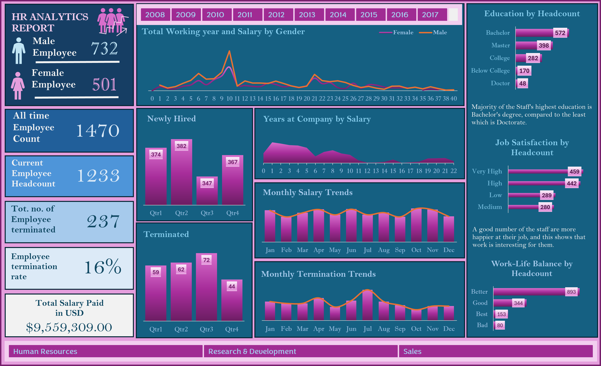

# 📊 HR Workforce Analytics Dashboard

## Overview
This project analyzes employee workforce data to uncover trends related to hiring, employee retention, salaries, education levels, job satisfaction, and work-life balance.   
An interactive dashboard was developed using Microsoft Excel to support HR decision-making.

## Objectives
- Analyze workforce demographics and employment trends.
- Monitor hiring and employee termination patterns.
- Visualize salary distribution and workforce metrics.
- Provide actionable insights for HR decision-making.

## Tools Used
- Microsoft Excel
- Pivot Tables
- Pivot Charts
- Slicers
- Dashboard Design
- Data Cleaning

## Key Performance Indicators (KPIs)
- Total Employees
- Current Employee Headcount
- Employee Termination Rate
- Total Salary Paid
- New Hires
- Employee Terminations

## Dashboard Features
- Interactive Year Filter
- Department Filter
- Salary Trend Analysis
- Employee Demographics
- Education Distribution
- Job Satisfaction Analysis
- Work-Life Balance Analysis

## Key Insights
- Bachelor's degree holders represent the largest educational group.
- Employee termination rate stands at **16%**.
- Work-life balance ratings are predominantly positive.
- Hiring remained relatively consistent throughout the year.
- Salary trends remained stable with minor monthly fluctuations.

## Skills Demonstrated
- Data Cleaning
- Exploratory Data Analysis (EDA)
- Dashboard Development
- Data Visualization
- HR Analytics
- Business Reporting

## Dashboard Preview

