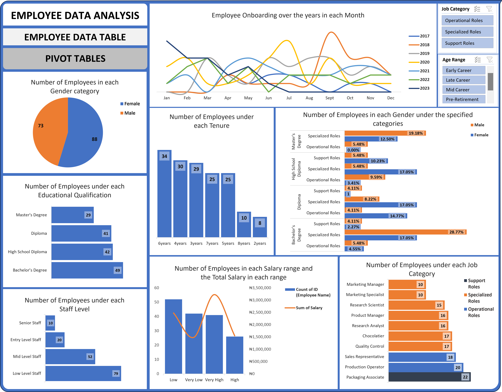

# 👔 Employee Workforce Analysis

## Overview
This project analyzes workforce composition by examining employee onboarding trends, tenure, educational qualifications, job categories, salary ranges, and staff levels. The dashboard enables HR teams to better understand workforce structure and support strategic planning.

## Business Problem
The organization required a dashboard to monitor workforce composition, employee onboarding, salary distribution, and job categories to improve workforce planning and resource allocation.

## Objectives
- Analyze workforce demographics.
- Monitor employee onboarding trends.
- Evaluate salary distribution.
- Understand employee tenure.
- Compare workforce composition across job categories.

## Dataset
The dataset contains employee information, including:  
- Gender
- Educational qualification
- Staff level
- Job category
- Salary range
- Year of Join (Employment year)
- Tenure

## Tools Used
- Microsoft Excel
- Pivot Tables
- Pivot Charts
- Dashboard Design
- Slicers
- Data Cleaning

## Key Performance Indicators (KPIs)
- Employee Gender Distribution
- Educational Qualification Distribution
- Staff Level Distribution
- Salary Range Distribution
- Employee Tenure
- Employee Onboarding Trends

## Dashboard Features
- Job Category Filter
- Age Range Filter
- Employee Onboarding Trends
- Salary Analysis
- Educational Qualification Breakdown
- Workforce Composition

## Key Insights
- Bachelor's degree holders represent the largest employee group.
- Operational roles account for a significant proportion of the workforce.
- Most employees fall within the lower staff levels.
- Employee onboarding varied across reporting years.
- Workforce tenure is concentrated within the early years of employment.

## Skills Demonstrated
- Workforce Analytics
- Data Cleaning
- Dashboard Development
- Data Visualization
- Exploratory Data Analysis (EDA)
- Business Reporting

## Dashboard Preview

