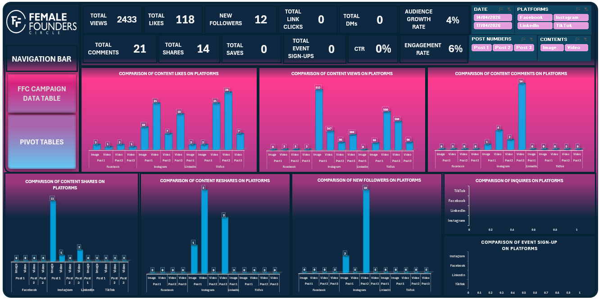

# 📊 Female Founders Circle Marketing Analytics Dashboard

## Project Note
> **🏢 Project Type:** Real-World Volunteer Project  
This project was completed as part of my volunteer role as a **Data Analyst for Female Founders Circle (FFC)** during the marketing campaign for the **Networking Cocktail 2.0** event, held in **June 2026**.  
The analysis presented in this repository is based on the marketing data available between **14 April and 5 May 2026**.  
Following my analysis, I presented recommendations to improve campaign performance, many of which were implemented by the marketing team. However, the post-implementation campaign data was not made available, so this project documents the analysis and recommendations based on the available dataset only.  
To respect the confidentiality of organizational data, this repository contains only the dashboard preview and project documentation. The original Excel workbook and underlying dataset are not included.

## Overview
This project analyzes the early performance of digital marketing campaigns for the Female Founders Circle (FFC) Networking Cocktail 2.0 event. Using campaign data collected between 14 April and 5 May 2026, I developed an interactive Microsoft Excel dashboard to monitor audience engagement, campaign reach, content performance, and social media growth across multiple platforms.  
The resulting analysis provided data-driven recommendations that informed marketing decisions ahead of the June 2026 event.

## Business Problem
As a volunteer Data Analyst for Female Founders Circle (FFC), I developed this dashboard to monitor marketing performance and provide actionable insights that could improve campaign effectiveness and event awareness.  
Although the available data covered only the early campaign period (14 April - 5 May 2026), the insights generated were shared with the marketing team and contributed to strategic decisions for the remainder of the campaign.

## Objectives
- Monitor campaign performance.
- Compare platform engagement.
- Measure audience growth.
- Evaluate content effectiveness.
- Support marketing decisions with data.

## Dataset
The analysis was performed using marketing performance data collected during the early stages of the Female Founders Circle Networking Cocktail 2.0 campaign (14 April - 5 May 2026).  
The dataset included metrics such as:
- Views
- Likes
- Comments
- Shares
- Followers
- Direct Messages
- Audience Growth
- Platform Performance Metrics  
**Note:** The original dataset is not included in this repository because it contains organizational data used during a live marketing campaign. Additionally, campaign data collected after my recommendations were implemented was not made available, so this project reflects analysis only of the available reporting period.

## Tools Used
- Microsoft Excel
- Pivot Tables
- Pivot Charts
- Dashboard Design
- Slicers
- Data Cleaning

## Key Performance Indicators (KPIs)
- Total Views
- Likes
- Comments
- Shares
- Audience Growth Rate
- Engagement Rate
- CTR
- Event Sign-ups

## Dashboard Features
- Platform Filter
- Content Type Filter
- Campaign Date Filter
- Audience Growth Dashboard
- Engagement Dashboard

## Key Insights
Based on the available campaign data (14 April - 5 May 2026):
- Instagram generated the strongest audience growth during the reporting period.
- Video content produced higher engagement than image posts.
- Instagram generated significant content-sharing activity.
- Platform performance varied depending on content format.
- The analysis identified opportunities to improve campaign reach and audience engagement before the event.

## Skills Demonstrated
- Marketing Analytics
- KPI Reporting
- Dashboard Development
- Data Visualization
- Exploratory Data Analysis (EDA)
- Business Reporting

## Dashboard Preview

