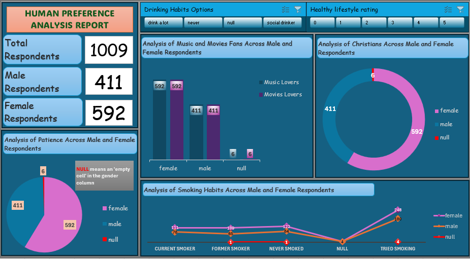

# 📊 Human Preference Analysis Dashboard

## Project Note
> This repository contains the dashboard preview and project documentation. The original workbook is unavailable, but the README describes the methodology, tools, KPIs, and key insights from the analysis.

## Overview
This project analyzes survey responses from over 1,000 participants to identify trends in entertainment preferences, lifestyle choices, smoking habits, patience levels, and religious affiliation.

## Business Problem
The objective was to understand behavioral patterns and demographic preferences from survey responses to identify meaningful trends that could support research and decision-making.

## Objectives
- Analyze respondent demographics.
- Compare preferences across gender.
- Explore lifestyle choices.
- Examine smoking habits.
- Identify behavioral patterns.

## Dataset
The dataset consists of survey responses containing:
- Gender
- Lifestyle ratings
- Drinking habits
- Entertainment preferences
- Religious affiliation
- Smoking habits
- Patience levels

## Tools Used
- Microsoft Excel
- Pivot Tables
- Pivot Charts
- Dashboard Design
- Slicers
- Data Cleaning

## Key Performance Indicators (KPIs)
- Total Respondents
- Male Respondents
- Female Respondents
- Entertainment Preferences
- Smoking Habits
- Lifestyle Ratings

## Dashboard Features
- Lifestyle Rating Filter
- Drinking Habit Filter
- Entertainment Preference Dashboard
- Religious Distribution
- Smoking Habit Analysis

## Key Insights
- Female respondents represented the majority of survey participants.
- Most respondents reported trying smoking.
- Lifestyle preferences varied across respondents.
- Missing responses were successfully identified during data preparation.

## Skills Demonstrated
- Survey Analytics
- Data Cleaning
- Exploratory Data Analysis (EDA)
- Dashboard Development
- Data Visualization
- Business Reporting

## Dashboard Preview

