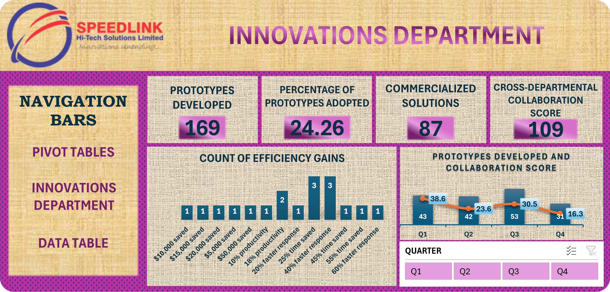

# 📊 Innovation Department KPI Dashboard

## Project Note
> This project was developed using a self-generated (dummy) dataset to simulate innovation department performance metrics for dashboard design and analytical practice.

## Overview
This dashboard analyzes the innovation department's performance by tracking prototype development, commercialization, collaboration, and operational efficiency.

## Business Problem
The company management requires timely insights into prototype development, collaboration, commercialization, and operational performance to evaluate the innovation department's success and identify opportunities for improvement.

## Objectives
- Monitor prototype development.
- Measure commercialization.
- Track collaboration.
- Evaluate operational efficiency.
- Visualize innovation department KPIs.

## Dataset
A self-generated dataset was created containing:
- Prototype records
- Commercialized solutions
- Collaboration scores
- Efficiency gains
- Quarterly performance metrics

## Tools Used
- Microsoft Excel
- Pivot Tables
- Pivot Charts
- Dashboard Design
- Slicers
- Data Cleaning

## Key Performance Indicators (KPIs)
- Prototypes Developed
- Commercialized Solutions
- Prototype Adoption Rate
- Collaboration Score
- Efficiency Gains

## Dashboard Features
- Quarter Filter
- Prototype Dashboard
- Collaboration Dashboard
- Commercialization Dashboard
- Efficiency Analysis

## Key Insights
- More than 160 prototypes were developed during the reporting period.
- Nearly one-quarter of developed prototypes were adopted.
- Collaboration scores varied across quarters.
- Operational efficiency improvements contributed to innovation outcomes.

## Skills Demonstrated
- Operational Analytics
- KPI Reporting
- Dashboard Development
- Data Cleaning
- Data Visualization
- Business Reporting

## Dashboard Preview

